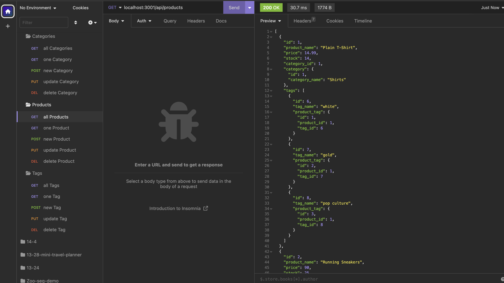

# 13: E-Commerce Back End     

## Description

The back end for an e-commerce site to track categories, products associated to a category, and tags associated with products. Built with an Express.js API using Sequelize to interact with a MySQL database. 

  

## Table of Contents

- [Installation](#installation)
- [Usage](#usage)
- [License](#license)
- [Tests](#tests)
- [Credits](#credits)
- [How to Contribute](#how-to-contribute)
- [Questions](#questions)

## Installation
NOTE: Requires [Node.js](https://nodejs.org/en) and [MySQL](https://dev.mysql.com).
1. Clone the repo to your local machine.  
2. Create a `.env` file in the root directory with the database name, user, and password as defined in the included `.env.EXAMPLE` except replace user and password with your MySQL login.  
3. With the cloned location as the active directory, install the npm dependencies from terminal with the command: `npm i`.  
4. Start the MySQL Shell with the command: `mysql -u[user] -p` 
where `[user]` is your login. Provide the password when prompted.  
5. Initiate the database with the command: `SOURCE db/schema.sql`
6. Exit MySQL Shell with the command: `exit`
7. If you want to start with sample seed data, enter the command: `npm run seed`

## Usage

With the cloned location as the active directory, start the server from terminal with the command `npm start`.  
From the client side (i.e. from a browser or a REST API client like Insomnia), interact with the database at: http://localhost:3001.  
Create, read, update, and delete database entries using the following endpoints/methods:  
### Categories:
- GET     /api/categories     --read all Categories
- GET     /api/categories/`category_id`     --read single Category with `category_id`
- POST     /api/categories     --create a new Category with a JSON body:   
   { "category_name": "`string`" }
- PUT     /api/categories/`category_id`     --update a Category with a JSON body:   
   { "category_name": "`string`" }
- DELETE     /api/categories/`category_id`     --delete single Category with `category_id`  

### Products
- GET     /api/products     --read all Products
- GET     /api/products/`product_id`     --read single Product with `product_id`
- POST     /api/products     --create a new Product with a JSON body:  
   {  
     "product_name": "`string`",  
     "price": `decimal`,  
     "stock": `integer`,  
     "tagIds": `array of integers`  
    }
- PUT     /api/products/`product_id`     --update a Product with a JSON body:   
   {  
     "product_name": "`string`",  
     "price": `decimal`,  
     "stock": `integer`,  
     "tagIds": `array of integers`  
    }
- DELETE     /api/products/`product_id`     --delete single Product with {product_id}  

### Tags
- GET     /api/tags     --read all Tags
- GET     /api/tags/`tag_id`     --read single Tag with `tag_id`
- POST     /api/tags     --create a new Tag with a JSON body:  
   {  
     "tag_name": "`string`",  
     "productIds": `array of integers`  
    }
- PUT     /api/tags/`tag_id`     --update a Tag with a JSON body:   
   { "tag_name": "`string`" }
- DELETE     /api/tags/`tag_id`     --delete single Tag with {tag_id}  

See [Walk-Thru Video]() for a detailed walk-thru of installing and using the API with sample seed data using VS Code's Integrated Terminal and Insomnia REST API Client.

## License

This project is covered under the following license: MIT License  
Refer to LICENSE in the repo for additional details.

## Tests

N/A

## Credits

N/A

## How to Contribute

[Contributor Covenant](https://www.contributor-covenant.org/)

## Questions

For questions or suggestions, contact:  
GitHub: [@aerostokes](https://github.com/aerostokes)  
Email: [rhonda@aerostokes.com](mailto:rhonda@aerostokes.com)